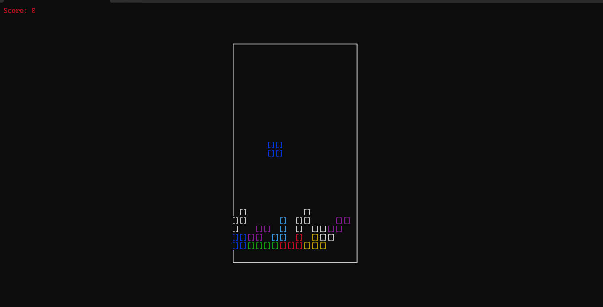

# Terminal Tetris Game (Python Curses)

This is a simple Tetris game implemented in Python using the `curses` library. The game runs in the terminal and includes basic Tetris functionality like rotating, moving blocks, and line clearing.

## Requirements
- Python 3
- `curses` module (pre-installed in most Unix-based systems like Linux and macOS)
- `pygame`

## Installation
1. Clone the repository:
   ```bash
   git clone https://github.com/MR-Amouei/tetris-terminal.git
   cd tetris-terminal
   ```

2. Run the game:
   ```bash
   python main.py
   ```

## Controls
- **Left Arrow**: Move block left
- **Right Arrow**: Move block right
- **Down Arrow**: Accelerate block downwards
- **Up Arrow**: Rotate block
- **q**: Quit the game

## Screenshots

